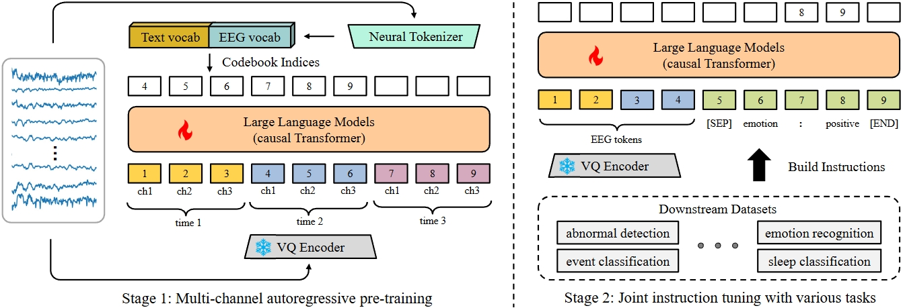

# NeuroLM
This is the official implementation of our ICLR 2025 paper "[NeuroLM: A Universal Multi-task Foundation Model for Bridging the Gap between Language and EEG Signals](https://openreview.net/forum?id=Io9yFt7XH7)".

\[Acknowledgement\] Our code is based on [nanoGPT](https://github.com/karpathy/nanoGPT) and [LaBraM](https://github.com/935963004/LaBraM).

The code is rearranged and not fully tested. If you find any bug, please contact me.


## Abstract
Recent advancements for large-scale pre-training with neural signals such as electroencephalogram (EEG) have shown promising results, significantly boosting the development of brain-computer interfaces (BCIs) and healthcare. However, these pre-trained models often require full fine-tuning on each downstream task to achieve substantial improvements, limiting their versatility and usability, and leading to considerable resource wastage. To tackle these challenges, we propose NeuroLM, the first multi-task foundation model that leverages the capabilities of Large Language Models (LLMs) by regarding EEG signals as a foreign language, endowing the model with multi-task learning and inference capabilities. Our approach begins with learning a text-aligned neural tokenizer through vector-quantized temporal-frequency prediction, which encodes EEG signals into discrete neural tokens. These EEG tokens, generated by the frozen vector-quantized (VQ) encoder, are then fed into an LLM that learns causal EEG information via multi-channel autoregression. Consequently, NeuroLM can understand both EEG and language modalities. Finally, multi-task instruction tuning adapts NeuroLM to various downstream tasks. We are the first to demonstrate that, by specific incorporation with LLMs, NeuroLM unifies diverse EEG tasks within a single model through instruction tuning. The largest variant NeuroLM-XL has record-breaking 1.7B parameters for EEG signal processing, and is pre-trained on a large-scale corpus comprising approximately 25,000-hour EEG data. When evaluated on six diverse downstream datasets, NeuroLM showcases the huge potential of this multi-task learning paradigm.
## Model Weights
Our model checkpoints are available at [HuggingFace](https://huggingface.co/Weibang/NeuroLM).
## Environment Set Up
Install required packages:
```bash
conda create -n NeuroLM python=3.12
conda activate NeuroLM
conda install pytorch==2.5.0 torchvision==0.20.0 torchaudio==2.5.0 pytorch-cuda=12.4 -c pytorch -c nvidia
pip install transformers datasets==2.21.0 tiktoken wandb h5py einops pandas scikit-learn
```
## Run Experiments
### Prepare pre-training data
You should transfer raw EEG files (such as .cnt, .edf, .bdf, and so on) into pikle files using the example code in dataset_maker (one file represents one sample). Notably, you can also write your own codes for preprocessing EEG data. Make sure that the preprocessing is consistent with that of our paper, that is, removing useless channels, filtering between 0.1 Hz and 75 Hz, notch filtering of 50 Hz or 60 Hz, resampling to 200 Hz, and setting the unit to $\mu V$.
```bash
python python prepare_TUH_pretrain.py
```
Also, you should prepare the text dataset by runing the script in text_dataset_maker.
```bash
python python prepare.py
```
### Train the text-aligned neural tokenizer
The neural tokenizer is trained by vector-quantized neural spectrum prediction. We train it on platforms with 8 * NVIDIA A100-80G GPUs.
```bash
OMP_NUM_THREADS=1 torchrun --nnodes=1 --nproc_per_node=8 train_vq.py \
    --dataset_dir /path/to/your/dataset \
    --out_dir /path/to/save \
    --wandb_log \
    --wandb_project your_project_name \
    --wandb_runname your_runname \
    --wandb_api_key your_api_key \
```
### NeuroLM pre-train
We pre-train NeuroLM by multi-channel autoregressive pre-training.
```bash
OMP_NUM_THREADS=1 torchrun --nnodes=1 --nproc_per_node=8 train_pretrain.py \
    --dataset_dir /path/to/your/dataset \
    --out_dir /path/to/save \
    --tokenizer_path checkpoints/VQ.pt \
    --wandb_log \
    --wandb_project your_project_name \
    --wandb_runname your_runname \
    --wandb_api_key your_api_key \
```
### Multi-task instruction tuning on downstream tasks
Before fine-tuning, use the code in dataset_maker/(make_TUAB.py, make_TUEV.py, etc.) to preprocess the downstream datasets as well as split data into training, validation, and test set. Notably you are encouraged to try different hyperparameters, such as the learning rate and warmup_epochs which can largely influence the final performance, to get better results.
```bash
OMP_NUM_THREADS=1 torchrun --nnodes=1 --nproc_per_node=8 train_instruction.py \
    --dataset_dir /path/to/your/dataset \
    --out_dir /path/to/save \
    --NeuroLM_path checkpoints/NeuroLM-B.pt \
    --wandb_log \
    --wandb_project your_project_name \
    --wandb_runname your_runname \
    --wandb_api_key your_api_key \
```
## Citation
If you find our paper/code useful, please consider citing our work:
```
@inproceedings{
jiang2025neurolm,
title={Neuro{LM}: A Universal Multi-task Foundation Model for Bridging the Gap between Language and {EEG} Signals},
author={Wei-Bang Jiang and Yansen Wang and Bao-Liang Lu and Dongsheng Li},
booktitle={The Thirteenth International Conference on Learning Representations},
year={2025},
url={https://openreview.net/forum?id=Io9yFt7XH7}
}
```
